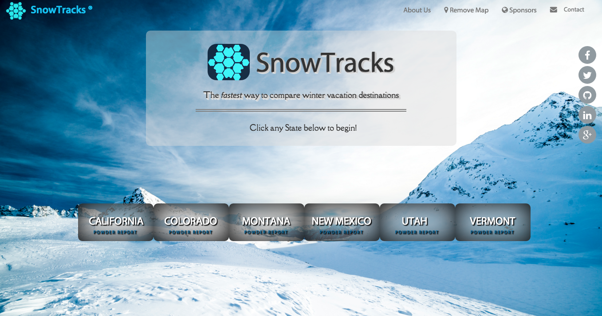
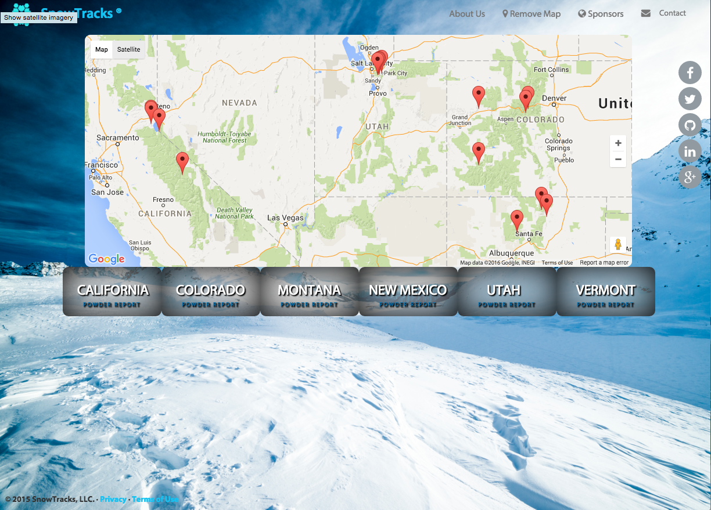

# SnowTracks
We love snow and want to help you find the best resorts, do quick vacation planning, and track winter weather conditions!

###**About this App** 
**It's a** mashup of Google Maps API with SnoCountry API in a single-page website **for** winter sports enthusiasts and vacation travel planners 
**who** want to quickly view the snow conditions with a map of relevent activities and resort facilities in a given location.

>The Google Maps API allow for the embedding of Google Maps onto web pages of outside developers, using a simple JavaScript interface or a Flash interface.

>The SnoCountry API provides developer access to snow conditions and resort data. Responses may be returned in JSON or HTML format.

##Google Maps API with SnoCountry API (mashup)
###*Google Maps API features*
    Feature 1: The user can view content that is customized based on their device location, or manually 
                select one.
          Method: The Navigator.geolocation read-only property, which returns a Geolocation object that 
                gives access to the location of the device.
    Feature 2: The user can view an approximately 200 mi diameter scalable Google map image, giving the 
                user feedback on the location they select, viewable as colored pushpins. Organic local
                search results will be red pushpins, user-generated results will have blue pushpins.
          Method: Google Maps API generating the organic red pushpins, user input will fetch additional 
                pins according to the query scope (however specific the search)
    Feature 3: The user can view information about resort facilities and local activities relevent to 
                winter sports and vacation planning when a pin is selected by the user. 
          Method: Google Maps API generates pin data on user click, pins will bring up an info box from 
                the right side of the Google Map with a picture and details on that pushpin (same as 
                official Google.com/maps site)

###*SnoCountry API*
    Feature 1: user can view accurate, meteorologist-approved snow reports and forecasts for a specific
                date range.
    Feature 2: user can explore local activities that are useful for winter sports enthusiasts and 
                vacation travel planners.
    Feature 3: user can select a specific resort from the location bar's dropdown menu to view additional 
                information on ski resort facilities, trailmap, star rating, live webcams, and pictures.